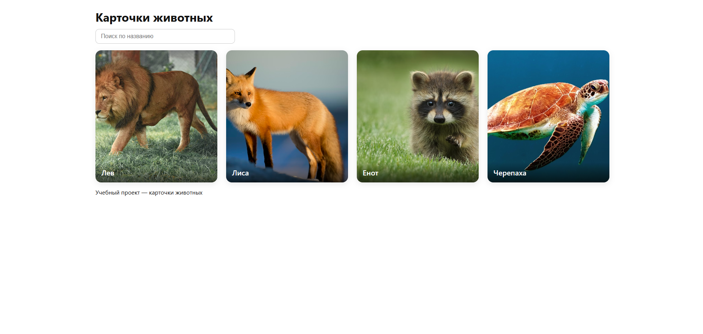

# Карточки животных 🐾  
Учебный проект на React

## 📌 Описание
Приложение выводит карточки животных с изображениями и названиями.  
Есть поиск по имени, адаптивная сетка карточек и современный интерфейс.

Приложение создано в рамках учебной контрольной работы.

🔗 **Онлайн-версия:**  
https://fryzux.github.io/animal-cards/

---

## 🚀 Основной функционал

- отображение списка животных (30 карточек);
- поиск по названию (реагирует в реальном времени);
- красивые карточки с изображением, градиентом и подписью;
- адаптивная верстка;
- чистая структура проекта;
- деплой через GitHub Pages.

## 🖼 Скриншоты работы приложения

### 🔹 Главная страница

### 🔹 Поиск по названию

### 🔹 Карточки животных

---